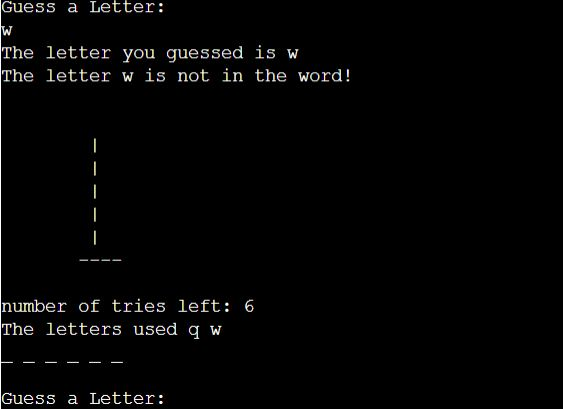

# **Project Portfolio  - Python Essentials submission - Hangman Game**

## **Overview**

Hangman is a Python terminal game, which runs on a mock terminal which is viewed on Heroku.

The aim of the game is to try to guess all the letters of a secret word chosen at random by the computer. The user has a limited number of tries. If they fail to guess all the correct letters within the set number of tries, they will lose that round of the game and they can try  again. If they guesss the correct letters within the set number of tries, the user will have won!
It's intended audience is anyone who wants a mental break or to decompress from a stressful programming situation! 

## Repository
[Github repository](https://github.com/Joannarama/the-Oracle)

## Live site

## Table of Contents

- [Scoping Phase](#scoping-phase)
  - [User Stories](#user-stories)
  - [Site Owner Objectives](#site-owner-objectives)
  - [How Objectives will be achieved](#how-the-objectives-will-be-achieved)
  - [Features](#features)

- [Planning](#planning)

- [Features](#features)
  -[Landing Page](#landing-page)

- [How to play](#how-to-play)
- [Gameplay](#gameplay-area)

- [Technologies used](#technologies-used)
- [Languages](#languages-used)

# **Scoping phase**

## ***User Stories***
* As a user I want to quickly and easily understand how to play the game
* As a user I want to have a positive response to my interaction with the game
* As a user to have a leisurely engagement with a fun game

## ***Site Owner Objectives***
* As a site owner, I want the user to play an enjoyable game
* As a site owner, I want the user to understand easily how to initiate and proceed through the game
* As a site owner, I want the user to have a positive engagement with the game

## ***How the Objectives will be achieved***
The objectives will be achieved by 
* Offering clear instructions on how to play
* Indicating what action the user must take at each step
* Notifying the user if they have made an error
* Counting down the tries remaining for the user
* Congratulate them if they have won or encourage to play again if they lost

# **Planning**
I created a flowchart in Lucid chart to help organise the structure of the game and my approach to it's development

# **Features**

## ***Landing Page***
On the landing page, the user sees the Welcome to Hangman title and is prompted to choose an option:
1. Rules 
2. Game

### User selects 1

When the user selects choice 1, the rules of the game are displayed. 

The user presses enter to continue to the game. 

### User selects 2

When the user selects choice 2, the game begins. The user is shown the 'secret' word by the computer and is prompeted to guess their letter:

### User chooses an incorrect letter

If the user selects an incorrect letter, their tries are reduced by 1, the hangman graphic draws one stage and the letter they have tried is added to the letters used array:

### User chooses a correct letter

when the user chooses a correct letter, that letter appears in it's place in the word. 
Correct uppercase letters render where they appear in the word, for example, if the user selects the letter 'b' and the secret workd is 'Batman', the letter 'b' will appear in uppercase. 

## ***Errors and notifications***

### Errors
Only alphabetic characters are permitted. If the user enters numeric or special characters, they will be informed of the error:

### Notifications

When the user is successful, they are notified that they have won and can play again:

When the user has not guessed all letters correctly, they will have lost and can play again:

# **Data Model**
## **Object Oriented Programming using Classes**

This program uses Object Oriented Programming and the following classes were developed:
*word
*hangman
*game_data

Welcome Joannarama,

This is the Code Institute student template for deploying your third portfolio project, the Python command-line project. The last update to this file was: **August 17, 2021**

## Reminders

* Your code must be placed in the `run.py` file
* Your dependencies must be placed in the `requirements.txt` file
* Do not edit any of the other files or your code may not deploy properly

## Creating the Heroku app

When you create the app, you will need to add two buildpacks from the _Settings_ tab. The ordering is as follows:

1. `heroku/python`
2. `heroku/nodejs`

You must then create a _Config Var_ called `PORT`. Set this to `8000`

If you have credentials, such as in the Love Sandwiches project, you must create another _Config Var_ called `CREDS` and paste the JSON into the value field.

Connect your GitHub repository and deploy as normal.

## Constraints

The deployment terminal is set to 80 columns by 24 rows. That means that each line of text needs to be 80 characters or less otherwise it will be wrapped onto a second line.

-----
Happy coding!