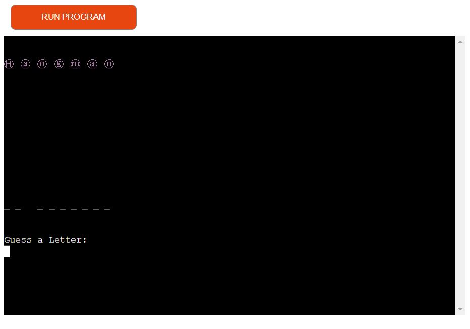

# **Project Portfolio  - Python Essentials submission - Hangman Game**

## **Overview**

Hangman is a Python terminal game, which runs on a mock terminal which is viewed on Heroku.

The aim of the game is to try to guess all the letters of a secret word chosen at random by the computer. The user has a limited number of tries. If they fail to guess all the correct letters within the set number of tries, they will lose that round of the game and they can try  again. If they guesss the correct letters within the set number of tries, the user will have won!
It's intended audience is anyone who wants a mental break or to decompress from a stressful programming situation! 

## Repository
[Github repository](https://github.com/Joannarama/pp2-hangman)

## Live site
[Live Site](https://pp3-classic-hangman.herokuapp.com/)

## Table of Contents

- [Scoping Phase](#scoping-phase)
  - [User Stories](#user-stories)
  - [Site Owner Objectives](#site-owner-objectives)
  - [How Objectives will be achieved](#how-the-objectives-will-be-achieved)
  
- [Features](#features)
  - [Landing page](#landing-page)
  - [User selects 1](#user-selects-1)
  - [User selects 2](#user-selects-2)
  - [User incorrect letter](#user-chooses-an-incorrect-letter)
  - [User correct letter](#user-chooses-a-correct-letter)
- [Errors and notifications](#errors-and-notifications)
  -[Errors](#errors)
  - [Notifications](#notifications)

- [Data Model](#data-model)
  - [OOP using classes](#object-oriented-programming-using-classes) 
  - [Libraries](#libraries)
  - [Separation of Concerns](#other-separation-of-concerns)

- [Testing](#testing)
  - [Bugs and fixes](#bugs-and-fixes)

- [Deployment to Heroku](#deployment-to-heroku)

- [Credits](#credits)

# **Scoping phase**

## ***User Stories***
* As a user I want to quickly and easily understand how to play the game
* As a user I want to have a positive response to my interaction with the game
* As a user I want to have a leisurely engagement with a fun game

## ***Site Owner Objectives***
* As a site owner, I want the user to play an enjoyable game
* As a site owner, I want the user to understand easily how to initiate and proceed through the game
* As a site owner, I want the user to have a positive engagement with the game

## ***How the Objectives will be achieved***
The objectives will be achieved by 
* Offering clear instructions on how to play
* Indicating what action the user must take at each step
* Notifying the user if they have made an error
* Counting down the tries remaining for the user
* Congratulate them if they have won or encourage to play again if they have lost

# **Planning**
I created a flowchart in Lucid chart to help organise the structure of the game and my approach to it's development

# **Features**

## ***Landing Page***
On the landing page, the user sees the Welcome to Hangman title and is prompted to choose an option:
1. Rules 
2. Game

### User selects 1

When the user selects choice 1, the rules of the game are displayed. 

The user presses enter to continue to the game. 

### User selects 2

When the user selects choice 2, the game begins. The user is shown the 'secret' word by the computer and is prompeted to guess their letter:

### User chooses an incorrect letter

If the user selects an incorrect letter, their tries are reduced by 1, the hangman graphic draws one stage and the letter they have tried is added to the letters used array:

### User chooses a correct letter

when the user chooses a correct letter, that letter appears in it's place in the word. 
Correct uppercase letters render where they appear in the word, for example, if the user selects the letter 'b' and the secret workd is 'Batman', the letter 'b' will appear in uppercase. 

## ***Errors and notifications***

### Errors
Only alphabetic characters are permitted. If the user enters numeric or special characters, they will be informed of the error:

### Notifications

When the user is successful, they are notified that they have won and can play again:

When the user has not guessed all letters correctly, they will have lost and can play again:

# **Data Model**
## ***Object Oriented Programming using Classes***

At the start of this project, anticipating that it would not be very extensive, I used a functional approach, creating functions in run.py. It quickly became apparent that the file was becoming large and unwieldy and difficult to read. Therefore I felt it would be beneficial to introduce a separation of concerns. 

Using Object Oriented Programming, I created 4 classes. These are 
* game - this manages the landing page and the rules
* hangman - this controls the gameplay functionality
* word - this manages the random selection of the word, prints the word/shows an underscore, checks if the letter is in the word etc. 
* bcolors.py - used to output different coloured text for errors/notifications etc in the terminal which creates definition and makes it more readable and easier to interact with.

# ***Libraries***
This project did not require any external libraries. It uses two built in Python library/modules:

* random - [a psuedo-random number generator](https://docs.python.org/3/library/random.html)

The purpose of this for this project was to randomly choose the word for the game from game_data.py using the random.choice function. 

* os - 
[clear console](https://stackoverflow.com/questions/517970/how-to-clear-the-interpreter-console)

Uses os.system to run a command. On windows machined the cls command clears the screen and on Linux the clear command is run. This name determines which system is being used.

This is used to clear data using from previous guesses which is no longer required which keeps a clean and legible apparance

# ***Other separation of concerns***

The game data, i.e. the lists of 'secret' words and the hangman stages graphics, were quite long and took up a lot of space. As such, these were moved to their own file, game_data.py. 
 

# **Testing**
This project was tested iteratively throughout the build in the following ways. 

* Testing the code in small chunks in the VS terminal to ensure that it was working as expected
* Testing the game once deployed to Heroku and in subsequent deployments by playing it using the different functionality to test expected outcomes. 
* Testing the user inputs thoroughly. Negative testing to ensure errors and notifications work as expected. 

# ***Bugs and fixes***

During the development process I encountered the following bugs and implemented fixes

**Bug**
When testing it was discovered that you could add to or more characters and the game continued to work.

**Fix**
The fix was to test for the length of the string entered using the len() function.

**Bug**
When adding some styling to the terminal which included clearing the terminal and printing the hangman logo and other game play elements some of the messaging was disappearing. The issue was that the messaging was printed to the screen and then cleared on the next loop of the game. 

**Fix**
The fix was to move the messaging to two new variables self.message and self.output and print these variables in the game play loop.

**Bug**
When the game was one or lost, and restarted, the word wasn’t updated to a new word.

**Fix**
The fix was to add a new method to the word class called reset

***PEP8 testing***
I checked the code in the PEP8 vaildator. The following errors were returned

* word.py - corrected trailing white space and blank lines 
* run.py - no errors

* In hangman.py the following error occured a number of times:
- **Error: Line 29, line too long**

- **Fix**
These errors were fixed by using parenthesise around these lines which allowed me to split the text into multiple lines and this resolved the issue. 

* game_data.py 
  - Error: blank line at end of file
  - Fix: deleted blank line

## **Deployment to Heroku**
The following are the steps taken to deploy to Heroku. 

* Create an account in Heroku. 
* Click on the 'New' button.
* In the Heroku dashboard, click 'Create new app'
* Then, create a unique name for the app
* Select your region, Europe/USA
* Click 'Create app'
* Navigate to 'Settings' from the settings tab. 
* Click the button labelled "Reveal Config Vars" and enter PORT for the key and 8000 as the Value and click the "add" button.
* The next step will add buildpacks to the application. 
* Click 'Add Buildpacks' and select Python and 'Save changes'
* Add another build pack called node.js to handle the mock terminal code and click 'Save' again
* Next navigate to the Deploy section from the deploy tab
* In the Deployment Method section, select GitHub
* Search for the GitHub repository name and click 'connect' when it has been correcly identified
* Select the correct branch to deploy from, in this case 'main' and select 'Automatic deploys'
* Click the 'View' button to navigate to the deployed link

## **Credits**

[Make all letters used lowercase](https://www.delftstack.com/howto/python/python-lowercase-list/)

[Remove all white spaces in word split and set to lower case](https://www.programiz.com/python-programming/methods/built-in/filter)

[List contains elements](https://www.techbeamers.com/program-python-list-contains-elements/)
[also:list contains elements](https://www.programiz.com/python-programming/methods/built-in/all)

[Limit input string character length](https://stackoverflow.com/questions/8761778/limiting-python-input-strings-to-certain-characters-and-lengths)

[OOP tutorial](https://realpython.com/python3-object-oriented-programming/)

[Hangman video](https://www.youtube.com/watch?v=m4nEnsavl6w)

[Hangman Header image taken from](https://fsymbols.com/text-art/)

[How to color the text](https://stackoverflow.com/questions/287871/how-to-print-colored-text-to-the-terminal)

[Clear console](https://stackoverflow.com/questions/517970/how-to-clear-the-interpreter-console)

## **Thank You**

Thanks to facilitator Kasia and my class group for support and help with this project. 

Thanks to the Code Institute for the material, direction and support! 

Have a great day :)